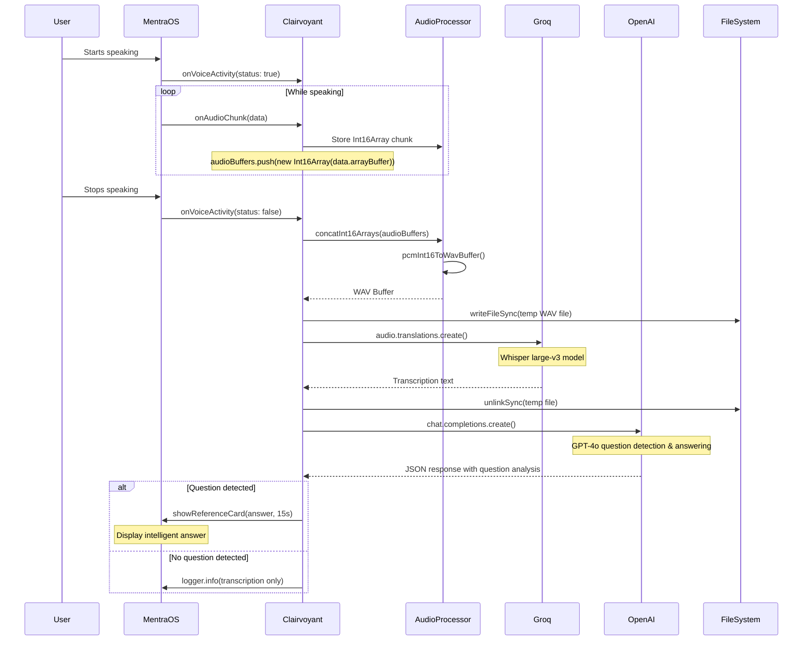

# Clairvoyant

A real-time voice transcription and intelligent Q&A application built with MentraOS that captures audio, processes it through Voice Activity Detection (VAD), transcribes speech using Groq's Whisper API, and provides intelligent answers to detected questions using OpenAI's GPT-4o.

## Overview

Clairvoyant is an advanced MentraOS application that provides real-time voice transcription with intelligent question detection and answering capabilities. It listens for voice activity, records audio chunks during speech, automatically transcribes the audio when the user stops speaking using Groq's Whisper large-v3 model, and then analyzes the transcription to detect questions and provide concise answers using OpenAI's GPT-4o model.

## Architecture

The application integrates four main components:
- **MentraOS**: Provides the application framework, audio streaming, and voice activity detection
- **Audio Processing**: Handles PCM to WAV conversion and audio buffer management  
- **Groq Whisper API**: Performs speech-to-text transcription
- **OpenAI GPT-4o**: Analyzes transcriptions for question detection and provides intelligent answers

## How It Works



## Setup Instructions

### Prerequisites

- [Bun](https://bun.sh) runtime
- [ngrok](https://ngrok.com) for tunneling
- MentraOS API key
- Groq API key
- OpenAI API key

### Installation

1. Install dependencies:
```bash
bun install
```

2. Create a `.env` file with your configuration:
```env
PACKAGE_NAME=your-package-name
MENTRAOS_API_KEY=your-mentraos-api-key
GROQ_API_KEY=your-groq-api-key
OPENAI_API_KEY=your-openai-api-key
PORT=3000
```

### Running the Application

1. Start the application:
```bash
bun run index.ts
```

2. Create a tunnel to expose your local server (required for MentraOS integration):
```bash
ngrok http --url=hamster-select-anchovy.ngrok-free.app 3000
```

## Key Features

- **Real-time Voice Activity Detection**: Automatically starts/stops recording based on speech detection
- **Audio Buffer Management**: Efficiently handles audio chunks and concatenation
- **WAV Format Conversion**: Converts PCM Int16 audio data to WAV format for API compatibility
- **Automatic Transcription**: Uses Groq's Whisper large-v3 model for high-quality speech-to-text
- **Intelligent Question Detection**: Analyzes transcriptions using OpenAI GPT-4o to identify questions
- **Automatic Answer Generation**: Provides concise answers (15 words or fewer) to detected questions
- **Smart Response Display**: Shows answers in MentraOS reference cards with configurable duration (15 seconds default)
- **Structured JSON Processing**: Uses OpenAI's JSON mode for reliable question analysis and response formatting
- **Temporary File Management**: Safely creates and cleans up temporary audio files
- **Real-time Status Updates**: Shows recording status and intelligent responses via MentraOS reference cards

## Technical Details

### Intelligent Processing Pipeline

The application now includes a sophisticated AI processing pipeline:

1. **Audio Capture**: Voice activity detection triggers audio recording
2. **Transcription**: Groq Whisper converts speech to text
3. **Question Analysis**: OpenAI GPT-4o analyzes the transcription using structured JSON output
4. **Response Generation**: If a question is detected, GPT-4o provides a concise answer
5. **Display Management**: Answers are displayed in reference cards with automatic timeout

### Question Detection System

The `cleanTranscription` function in `utils/chat.ts` implements intelligent question detection:

```typescript
interface QuestionAnalysisResponse {
	original_text: string;
	has_question: boolean;
	question: string | null;
	answer: string | null;
}
```

Key features:
- Uses OpenAI's JSON mode for reliable structured responses
- Detects questions in natural speech patterns
- Generates answers limited to 15 words or fewer for quick comprehension
- Handles edge cases and provides fallback responses
- Comprehensive error handling with logging

### Smart Display System

The application includes a sophisticated display management system:

```typescript
async function showReferenceCardWithTimeout(
	session: AppSession,
	title: string,
	text: string,
	options: { view?: ViewType; durationMs?: number } = {},
)
```

Features:
- Configurable display duration (default 15 seconds for answers)
- Automatic cleanup and return to main view
- Support for different view types
- Non-blocking asynchronous operation

### Audio Processing
- Captures audio as PCM Int16Array chunks at 16kHz sample rate
- Concatenates chunks during voice activity periods
- Converts to WAV format using the `wavefile` library
- Temporary files are automatically cleaned up after processing

### Voice Activity Detection
- Uses MentraOS built-in VAD capabilities
- Triggers recording start/stop based on speech detection
- Handles edge cases for continuous speech and silence

## Implementation Observations

- The audio processing continues after the user stops speaking. Can be tested as follows: 

```typescript
session.events.onAudioChunk((data) => {
			if (isSpeaking) {
				audioBuffers.push(new Int16Array(data.arrayBuffer));
				session.logger.info(
					`[Clairvoyant] AudioBuffer Size: ${audioBuffers.length}`,
				);
			}
		});
```

- A `.wav` file needs to be saved to then be sent to the Groq API. 

```typescript
async function sendAudioToGroq(
	session: AppSession,
	audioBuffers: Int16Array[],
	sampleRate = 16000,
) {
	const fullBuffer = concatInt16Arrays(audioBuffers);
	const wavBuffer = pcmInt16ToWavBuffer(fullBuffer, sampleRate);
	session.logger.info(`[Clairvoyant] WAV Buffer Size: ${wavBuffer.length}`);

	const filePath = writeTempWavFile(wavBuffer);

	try {
		const translation = await groq.audio.translations.create({
			file: fs.createReadStream(filePath),
			model: "whisper-large-v3",
		});
		session.logger.info(translation.text);
		const answer = await cleanTranscription(session, translation.text);
		return answer;
	} finally {
		deleteFileSafe(filePath, session.logger);
	}
}
```

### API Integration
- Integrates with Groq's Whisper API for transcription
- Uses OpenAI GPT-4o for intelligent question detection and answering
- Implements structured JSON responses for reliable AI processing
- Uses streaming file upload for efficient processing
- Implements proper error handling and cleanup for both APIs

## Dependencies

- `@mentra/sdk`: MentraOS application framework
- `groq-sdk`: Groq API client for Whisper transcription
- `openai`: OpenAI API client for intelligent question processing
- `wavefile`: Audio format conversion utilities
- Standard Node.js modules: `fs`, `path`

This project was created using `bun init` in bun v1.2.12.

