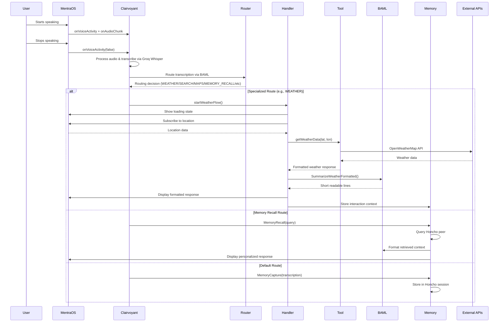

# Clairvoyant

A real-time voice transcription and intelligent context-aware assistant built with MentraOS that captures audio, processes it through intelligent routing, and provides personalized responses using multiple AI tools and persistent memory.

## Overview

Clairvoyant is an advanced MentraOS application that provides real-time voice transcription with intelligent routing to specialized AI capabilities. It listens for voice activity, transcribes speech using Groq's Whisper, routes queries to appropriate tools (weather, search, maps, memory, etc.), and provides concise, contextual responses through AI-powered formatting and persistent memory integration.

## Architecture

The application integrates six main layers:
- **MentraOS Framework**: Provides audio streaming, voice activity detection, and UI components
- **Intelligent Routing**: BAML-powered routing system that directs queries to appropriate handlers
- **Specialized Tools**: External API integrations (weather, search, maps, memory)
- **Handler Orchestration**: UX flow management with loading states and response formatting
- **AI Formatting**: BAML prompts that convert tool outputs to concise, readable responses
- **Persistent Memory**: Honcho-powered context and personalization system

## System Flow



## Key Features

### 🧠 Intelligent Routing System
- **BAML-powered routing**: Automatically classifies queries into categories (weather, search, maps, memory, knowledge)
- **Context-aware routing**: Routes questions about user's personal information to memory system
- **Extensible routing**: Easy to add new categories and handlers

### 🔧 Modular Tool Architecture
- **Weather Tool**: OpenWeatherMap integration with location services
- **Web Search Tool**: Tavily-powered real-time web search
- **Maps Tool**: Google Places API for location queries
- **Memory Tool**: Honcho-powered persistent context and personalization
- **Knowledge Tool**: General knowledge questions via AI

### 🎯 Handler-Based Flow Management
- **Async flow orchestration**: Non-blocking handlers with stale request protection
- **Loading state management**: User-friendly loading/success/error states
- **Location integration**: Automatic location requests where needed
- **Timeout handling**: Graceful fallbacks for slow/failed operations

### 🤖 AI-Powered Response Formatting
- **BAML prompt engineering**: Converts raw tool outputs to concise, readable responses
- **Token-efficient prompts**: Minimal data transfer with maximum information density
- **Consistent response format**: ≤3 lines, ≤10 words per line for optimal readability
- **Contextual formatting**: Responses tailored to user's query and personality

### 💾 Persistent Memory & Context
- **Honcho integration**: Persistent memory across sessions
- **Peer-based conversations**: Dedicated "diatribe" peer for raw transcription storage
- **Personal context**: Remembers user preferences, history, and personal information
- **Memory-aware responses**: Leverages stored context for personalized interactions

### 🎨 Smart UI Integration
- **Text wall displays**: Clean, timed text overlays in MentraOS interface
- **View management**: Automatic return to main view after responses
- **Duration optimization**: 3-second display timing for optimal readability
- **Error state handling**: Clear error messaging with automatic recovery

## Project Structure

### Core Organization
```
src/
├── index.ts                    # Main application entry point
└── utils/
    ├── transcriptionFlow.ts    # Central routing and transcription handler
    ├── baml_client/            # Generated BAML client (auto-generated)
    ├── core/                   # Core utilities
    │   ├── env.ts              # Environment variable validation
    │   ├── textWall.ts         # UI text display helpers
    │   └── rateLimiting.ts     # API rate limiting utilities
    ├── tools/                  # External API integrations
    │   ├── weatherCall.ts      # OpenWeatherMap integration
    │   ├── webSearch.ts        # Tavily web search integration
    │   ├── mapsCall.ts         # Google Places integration
    │   └── memoryCall.ts       # Honcho memory initialization
    ├── handlers/               # Flow orchestrators
    │   ├── weather.ts          # Weather query handler
    │   ├── search.ts           # Web search handler
    │   ├── maps.ts             # Location/maps handler
    │   ├── memory.ts           # Memory capture/recall handler
    │   └── knowledge.ts        # General knowledge handler
    └── types/                  # TypeScript type definitions
        └── schema.ts           # Zod validation schemas
```

### BAML Prompts & Routing
```
baml_src/
├── route.baml          # Main routing logic and route definitions
├── weather.baml        # Weather response formatting
├── search.baml         # Web search result formatting  
├── maps.baml           # Location/maps response formatting
├── recall.baml         # Memory recall formatting
├── answer.baml         # General knowledge formatting
├── clients.baml        # AI client configurations
└── generators.baml     # Code generation settings
```

## Setup Instructions

### Prerequisites
- [Bun](https://bun.sh) runtime
- [ngrok](https://ngrok.com) for tunneling
- API keys for: MentraOS, Groq, OpenAI, OpenWeatherMap, Tavily, Google Maps, Honcho

### Installation

1. Install dependencies:
```bash
bun install
```

2. Create a `.env` file with your configuration:
```env
PACKAGE_NAME=your-package-name
MENTRAOS_API_KEY=your-mentraos-api-key
GROQ_API_KEY=your-groq-api-key
OPENAI_API_KEY=your-openai-api-key
OPENWEATHERMAP_API_KEY=your-weather-api-key
TAVILY_API_KEY=your-tavily-api-key
GOOGLE_MAPS_API_KEY=your-google-maps-api-key
HONCHO_API_KEY=your-honcho-api-key
PORT=3000
```

3. Generate BAML client:
```bash
npx baml-cli generate
```

### Running the Application

1. Start the application:
```bash
bun run index.ts
```

2. Create a tunnel to expose your local server:
```bash
ngrok http --url=hamster-select-anchovy.ngrok-free.app 3000
```

## Intelligent Routing System

The application uses BAML-powered routing to intelligently direct user queries:

### Route Categories
- **WEATHER**: Current/upcoming weather for specific locations
- **WEB_SEARCH**: News, current events, time-sensitive information
- **MAPS**: Nearby businesses, addresses, directions
- **KNOWLEDGE**: General factual information
- **MEMORY_RECALL**: Personal information, preferences, history

### Routing Logic
```typescript
// baml_src/route.baml
enum Router {
    WEATHER @description("Current or upcoming weather questions for a specific place.")
    WEB_SEARCH @description("News, current events, facts that change over time.")
    MAPS @description("Finding nearby businesses, restaurants, addresses, or directions.")
    KNOWLEDGE @description("General knowledge that does not fit into other categories.")
    MEMORY_RECALL @description("Questions about user's personal history, preferences, or information.")
}
```

## Memory & Context System

### Persistent Memory with Honcho
- **Session Management**: Unique sessions per user interaction
- **Peer-based Storage**: Dedicated "diatribe" peer stores all transcriptions
- **Context Retrieval**: Intelligent context recall for personalized responses
- **Memory Integration**: Automatic context storage for all interactions

### Memory Flow
1. **Capture**: All transcriptions stored in Honcho session
2. **Recall**: Personal queries trigger memory retrieval
3. **Context**: Retrieved context formatted via BAML for natural responses
4. **Persistence**: Memory persists across application sessions

## Tool Integration Pattern

### Adding New Tools (Example: News Tool)

1. **Create Tool** (`src/utils/tools/newsCall.ts`):
```typescript
export async function getNewsData(query: string) {
  // API integration
  // Data validation
  // Return formatted response
}
```

2. **Add BAML Route** (`baml_src/route.baml`):
```baml
enum Router {
    // ... existing routes
    NEWS @description("Recent news articles and current events.")
}
```

3. **Create Handler** (`src/utils/handlers/news.ts`):
```typescript
export async function startNewsFlow(query: string, session: AppSession) {
  // Use showTextDuringOperation for UX
  // Call tool
  // Format via BAML
  // Display results
}
```

4. **Wire Routing** (`src/utils/transcriptionFlow.ts`):
```typescript
case Router.NEWS:
  void startNewsFlow(data.text, session);
  return;
```

5. **Regenerate BAML**:
```bash
npx baml-cli generate
```

## Technical Implementation Details

### Audio Processing
- **PCM to WAV conversion**: Handles audio format conversion for Groq API
- **Voice Activity Detection**: MentraOS built-in VAD for start/stop triggers
- **Buffer management**: Efficient audio chunk concatenation
- **Temporary file handling**: Safe creation and cleanup of audio files

### AI Integration
- **Groq Whisper**: High-quality speech-to-text transcription
- **Multiple AI clients**: OpenAI GPT-4o, Groq models via BAML configuration
- **Structured responses**: JSON mode for reliable AI output parsing
- **Token optimization**: Minimal data transfer with maximum information density

### Error Handling & Robustness
- **Stale request protection**: WeakMap-based runId tracking prevents outdated responses
- **Timeout handling**: Graceful fallbacks for location services and API calls
- **Error state management**: User-friendly error messages with automatic recovery
- **Rate limiting**: Built-in API rate limiting to prevent quota exhaustion

## Dependencies

### Core Framework
- `@mentra/sdk`: MentraOS application framework
- `@honcho-ai/sdk`: Persistent memory and context management

### AI & Processing
- `groq-sdk`: Groq API client for Whisper transcription
- `openai`: OpenAI API client for intelligent processing
- `baml`: AI prompt engineering and routing framework

### External APIs
- `wavefile`: Audio format conversion utilities
- Standard Node.js modules: `fs`, `path`, `crypto`

### Development
- `bun`: JavaScript runtime and package manager
- TypeScript for type safety
- Zod for runtime validation

## Contributing

When adding new tools or features:

1. Follow the established tool/handler pattern
2. Add appropriate BAML prompts and routing
3. Include proper error handling and UX states
4. Test routing logic with BAML test cases
5. Regenerate BAML client after changes
6. Update this README if adding new capabilities

This project was created using `bun init` in bun v1.2.12.
