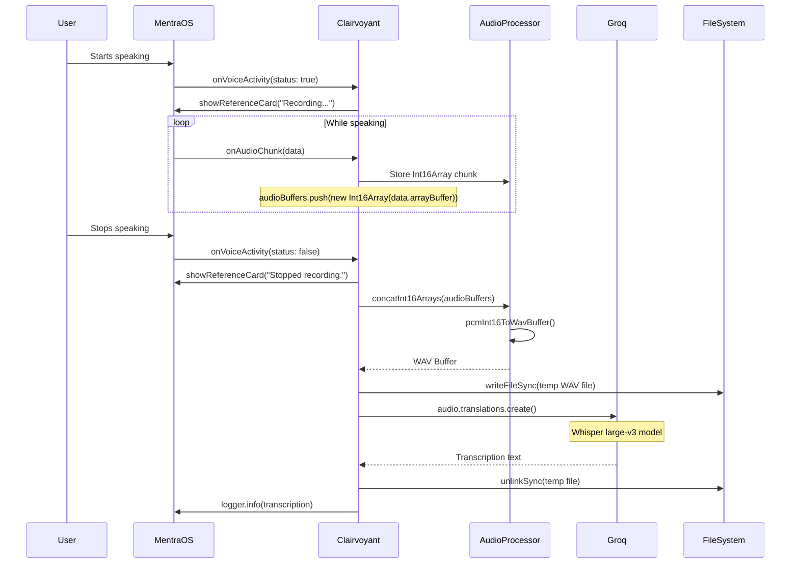

# Clairvoyant

A real-time voice transcription application built with MentraOS that captures audio, processes it through Voice Activity Detection (VAD), and transcribes speech using Groq's Whisper API.

## Overview

Clairvoyant is a MentraOS application that provides real-time voice transcription capabilities. It listens for voice activity, records audio chunks during speech, and automatically transcribes the audio when the user stops speaking using Groq's Whisper large-v3 model.

## Architecture

The application integrates three main components:
- **MentraOS**: Provides the application framework, audio streaming, and voice activity detection
- **Audio Processing**: Handles PCM to WAV conversion and audio buffer management  
- **Groq Whisper API**: Performs speech-to-text transcription

## How It Works



## Setup Instructions

### Prerequisites

- [Bun](https://bun.sh) runtime
- [ngrok](https://ngrok.com) for tunneling
- MentraOS API key
- Groq API key

### Installation

1. Install dependencies:
```bash
bun install
```

2. Create a `.env` file with your configuration:
```env
PACKAGE_NAME=your-package-name
MENTRAOS_API_KEY=your-mentraos-api-key
GROQ_API_KEY=your-groq-api-key
PORT=3000
```

### Running the Application

1. Start the application:
```bash
bun run index.ts
```

2. Create a tunnel to expose your local server (required for MentraOS integration):
```bash
ngrok http --url=hamster-select-anchovy.ngrok-free.app 3000
```

## Key Features

- **Real-time Voice Activity Detection**: Automatically starts/stops recording based on speech detection
- **Audio Buffer Management**: Efficiently handles audio chunks and concatenation
- **WAV Format Conversion**: Converts PCM Int16 audio data to WAV format for API compatibility
- **Automatic Transcription**: Uses Groq's Whisper large-v3 model for high-quality speech-to-text
- **Temporary File Management**: Safely creates and cleans up temporary audio files
- **Real-time Status Updates**: Shows recording status via MentraOS reference cards

## Technical Details

## Observations

- The audio processing continues after the user stops speaking. Can be tested as follows: 

```typescript
session.events.onAudioChunk((data) => {
			if (isSpeaking) {
				audioBuffers.push(new Int16Array(data.arrayBuffer));
				session.logger.info(
					`[Clairvoyant] AudioBuffer Size: ${audioBuffers.length}`,
				);
			}
		});
```

- A `.wav` file needs to be saved to then be sent to the Groq API. 

```typescript
async function sendAudioToGroq(
	session: AppSession,
	audioBuffers: Int16Array[],
	sampleRate = 16000,
) {
	const fullBuffer = concatInt16Arrays(audioBuffers);
	const wavBuffer = pcmInt16ToWavBuffer(fullBuffer, sampleRate);
	session.logger.info(`[Clairvoyant] WAV Buffer Size: ${wavBuffer.length}`);

	const filePath = writeTempWavFile(wavBuffer);

	try {
		const translation = await groq.audio.translations.create({
			file: fs.createReadStream(filePath),
			model: "whisper-large-v3",
		});
		session.logger.info(translation.text);
		const answer = await cleanTranscription(session, translation.text);
		return answer;
	} finally {
		deleteFileSafe(filePath, session.logger);
	}
}
```

### Audio Processing
- Captures audio as PCM Int16Array chunks at 16kHz sample rate
- Concatenates chunks during voice activity periods
- Converts to WAV format using the `wavefile` library
- Temporary files are automatically cleaned up after processing

### Voice Activity Detection
- Uses MentraOS built-in VAD capabilities
- Triggers recording start/stop based on speech detection
- Handles edge cases for continuous speech and silence

### API Integration
- Integrates with Groq's Whisper API for transcription
- Uses streaming file upload for efficient processing
- Implements proper error handling and cleanup

## Dependencies

- `@mentra/sdk`: MentraOS application framework
- `groq-sdk`: Groq API client for Whisper transcription  
- `wavefile`: Audio format conversion utilities
- Standard Node.js modules: `fs`, `path`

This project was created using `bun init` in bun v1.2.12.

